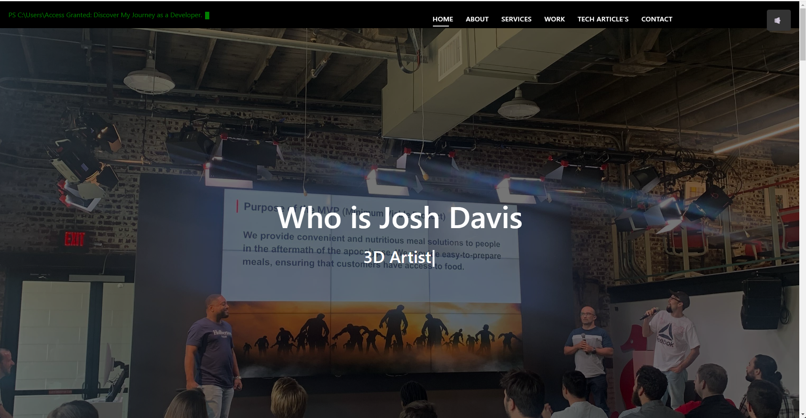

# Personal Website - Joshua Davis

This repository contains the code for my personal website, showcasing my portfolio, skills, and experiences as a full-stack web developer and 3D designer.

## Table of Contents

- [Introduction](#introduction)
- [Features](#features)
- [Technologies Used](#technologies-used)
- [Installation](#installation)
- [Usage](#usage)
- [Contributing](#contributing)
- [License](#license)

## Introduction

Welcome to my personal website! This website serves as a digital portfolio, highlighting my projects, skills, and journey in the field of computer science. As a student at Atlas School and an aspiring freelancer, I aim to showcase my abilities in web development, 3D design, and game development.

## Features

- Home section with a brief introduction and a typed.js animated subtitle
- About section with personal information, skills, and a profile picture
- Services section outlining the various services I offer
- Portfolio section displaying notable projects completed with Atlas School and for clients
- 3D & Game Design Portfolio section featuring side projects and game development endeavors
- Testimonials section with quotes from former employers and personal references
- Tech & Learning Articles section showcasing blog posts and articles on web development and design topics
- Contact section with a contact form and links to social media profiles
- Responsive design that adapts to different screen sizes and devices

## Technologies Used

- HTML5
- CSS3
- JavaScript
- Bootstrap 5
- Font Awesome icons
- Typed.js library
- Swiper.js library
- PHP (for form submission)

## Installation

To run this website locally, follow these steps:

1. Clone the repository:
git clone https://github.com/JD037/personal-website.git
2. Navigate to the project directory:
cd personal-website
3. Open the `index.html` file in your preferred web browser.

## Usage

Feel free to explore the different sections of the website to learn more about me, my projects, and my skills. You can navigate through the menu items to access specific sections or scroll through the page to view the content in order.

To get in touch with me, you can fill out the contact form in the Contact section or click on the social media icons to connect with me on various platforms.

## Contributing

As this is a personal website, contributions are not currently accepted. However, if you have any suggestions, feedback, or bug reports, please feel free to reach out to me via email or the contact form on the website.

## License

This project is licensed under the [MIT License](LICENSE). You are free to use and modify the code for personal or commercial purposes, but please provide attribution to the original source.

Thank you for visiting my website and taking the time to learn more about me and my work!

hosted gitpages URL

<https://jd037.github.io/personal_website/>
